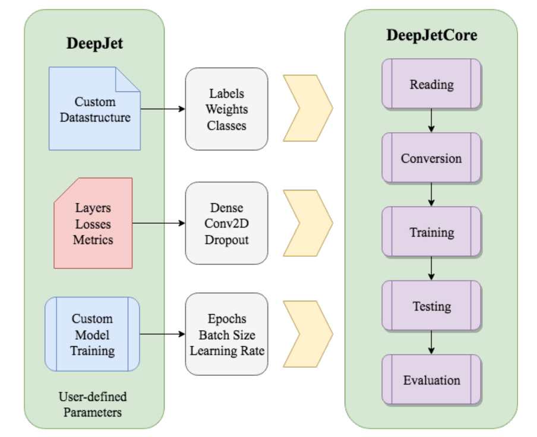
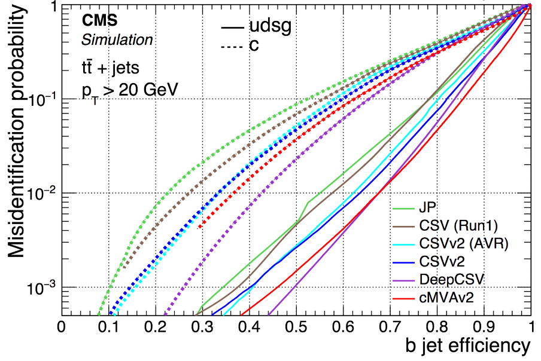

# DeepML

## Machine learning based on DeepJetCore

The framework is designed primarily as a tool to streamline the process to employ machine learning for multi-jet classification. As features were added to deal with the increasing computational complexity espoused by distributed systems and large-scale datasets, it gravitated towards a broader set of use-cases.



## Installation and environment

We are running within CMSSW (>10_2_X should have the keras, tensorflow, etc. libraries needed).
To install the software you can use the following
```
cmsrel CMSSW_10_2_0_pre5
cd CMSSW_10_2_0_pre5/src
cmsenv
git clone https://github.com/DL4Jets/DeepJetCore.git
cd DeepJetCore/compiled/
make -j 4
cd -
git clone https://gitlab.cern.ch/psilva/DeepML.git
cd DeepML
```
Once all is compiled see below some examples on how to run the regression.

## Preparing a flat tree as input

In case the variables are scattered accross different TTrees which are typically bound as friends in the analysis,
DeepJetCore (in particular root_numpy) prefers that a single tree is given as input to the training. 
In scripts/prepareTrainingTreeFromHeppy.py you can find a script which will gather the data in branches from different trees
and dump a summary tree which can be used as input for training. It may take some time to run locally if there are many events.
An example of how to run it is the following

```
python scripts/prepareTrainingTreeFromHeppy.py --tags WJets -o /eos/cms/store/cmst3/user/psilva/Wmass/Recoil_regress-data \
        /eos/cms/store/cmst3/group/wmass/w-helicity-13TeV/ntuplesRecoil/TREES_SIGNAL_1l_recoil_fullTrees/:tree:treeProducerWMass/tree.root 
        /eos/cms/store/cmst3/user/psilva/Wmass/FriendTREES_SIGNAL_1l_recoil_fullTrees/:Friends:tree_Friend_{0}.root
```

The arguments are the input directories, the name of the tree and a postfix to access the ROOT file. 
The first tree is assumed to be the main one, the subsequent are helper friend trees. The {0} can be used to substitute
the original name of the tree found in the first directory.



